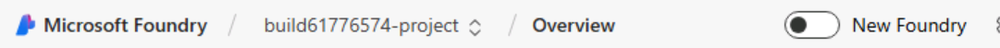
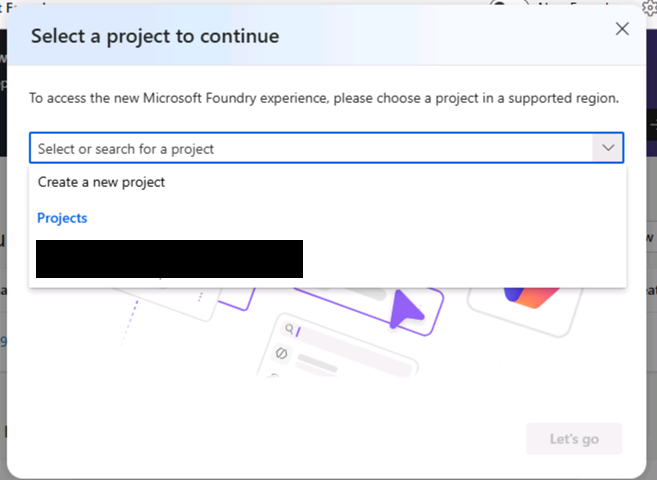

# Lab 1: Discover Models in Microsoft Foundry

> **Duration:** ~10 minutes | **Phase:** Orientation (UI)

## Scenario

You are **Serena**, a developer at **Zava** -- a large global home-improvement retailer that operates both online and physical stores. Zava's platform receives thousands of customer product reviews daily from shoppers like **Bruno**, who is renovating his kitchen. Your task is to build an automated review moderation system that classifies customer reviews before they go live on the site. Eventually, this system will work alongside **Cora**, Zava's AI shopping assistant, to keep the platform safe and helpful.

In this lab, you will explore the Microsoft Foundry model catalog to find a model that can power Zava's review moderation pipeline.

## Objective

Explore the Microsoft Foundry portal to discover available hosted models, understand model capabilities, and identify a model suitable for inference-based tasks like product review moderation.

---

## Step 1: Open Microsoft Foundry Portal

Open the Microsoft Foundry portal at https://ai.azure.com.

Select the **Start building** button and sign in with your Azure credentials.

You will land on the Foundry **resources** page. This is the central hub for managing AI resources.

Ensure the **New Foundry** switch at the top of the screen is turned on.



Now click the linked project name from the **All resources** listing to open it in Foundry. If a dialog opens asking what you would like to do next, you can close it.



> **If you are unable to view the project:**
>
> 1. Switch to the old Foundry portal by toggling the **New Foundry** switch off at the top of the page.
> 2. Click **Continue without feedback**.
> 3. The project will be visible in the old Foundry portal -- click on the project.
> 4. Once in the project, click the **New Foundry** toggle again to return to the new Foundry with the project retained.


---

## Step 2: Explore the Model Catalog

1. In the main window, click **Discover** from the top menu.
2. In the **Discover** section, browse the available models by clicking **Models**. These are production-ready, hosted models that you can use without fine-tuning.
3. You can use the filters within the **Models** page to narrow down the list. For example, you can filter by Supported features (Agent service, Fine-tuning, etc.), Source (Azure OpenAI, Microsoft, Meta, Mistral, etc.), or Inference Task (Chat Completion, Image Analysis, etc.). This lets you quickly filter models based on a specific task or requirement.

Select a model to view the details page. Take note of the following properties in the side box.

| Property | Common values |
|----------|-----------------|
| **Model provider** | Azure OpenAI, Microsoft AI, Meta, Mistral, etc. |
| **Task type** | Chat completion, Responses, Text to image |
| **Input type** | text, image |
| **Output type** | text, image |
| **Context window** | Varies by model (see model card) |
| **Token limits** | Varies by model (see model card) |

---

## Step 3: Identify a Model for This Lab

For this workshop, you need a model that supports **chat completion** -- the ability to accept a system prompt and user messages and return a structured response.

**Recommended models for this lab:**

| Model | Publisher | Why |
|-------|-----------|-----|
| gpt-5.4-mini | OpenAI | Fast, cost-efficient, excellent for classification |
| gpt-5.4 | OpenAI | Higher quality, good for complex moderation |
| Phi-4 | Microsoft | Strong reasoning, open-weight |

> **Tip:** gpt-5.4-mini is the best choice for this lab -- it is fast, inexpensive, and well-suited for moderation and classification tasks.

---

## Step 4: Check Model Details

For this workshop, you need a model that supports **chat completion** -- the ability to accept a system prompt and user messages and return a structured response. The **gpt-5.4-mini** model from Azure OpenAI is high quality, fast, and cost-efficient, which makes it ideal for Zava's review moderation pipeline.

Find **gpt-5.4-mini** in the catalog and open its detail page. Explore the tabs at the top:

1. **Details** -- Model description and capabilities
2. **Deployments** -- A list of current deployments of this model
3. **Benchmarks** -- Scores and performance metrics
4. **Responsible AI** -- Guardrails imposed on the model from Azure AI Content Safety
5. **License** -- Links to applicable licensing terms

> You will deploy this model programmatically in Lab 2. For now, just confirm it is available in the catalog and you can review the model card details.

---


## Step 5: Explore the Playground (Optional)

1. From the **gpt-5.4-mini** model's **Deployments** tab, select the existing deployment. This brings you to the **playground** for the model deployment.
2. In the **Instructions** field, enter:

```
You are a product review moderator for Zava, a home-improvement retailer. Classify the following customer review as SAFE, NEEDS_REVIEW, or UNSAFE. Respond with only the classification label.
```

3. In the **Chat with the model** field, enter:

```
This paint is garbage and whoever designed it should be fired
```

4. Click **Send** and observe the response

This is a preview of the inference pattern you will implement in code during Labs 3 and 4 to moderate Zava product reviews.

---

## What You Learned

- ✅ How to navigate the Microsoft Foundry portal
- ✅ How to browse the model catalog
- ✅ How to identify models suitable for chat completion tasks
- ✅ How a model responds to a Zava review moderation prompt

---

## Key Takeaway

> Microsoft Foundry provides access to production-ready hosted models from multiple publishers. You do not need to train, fine-tune, or host these models yourself -- you simply connect to them via API and start building. For Zava, this means Serena can have a working review moderation prototype in hours, not weeks.

---

**Next:** [Lab 2 - Verify your Microsoft Foundry Project](./lab2-verifysetup.md) 

