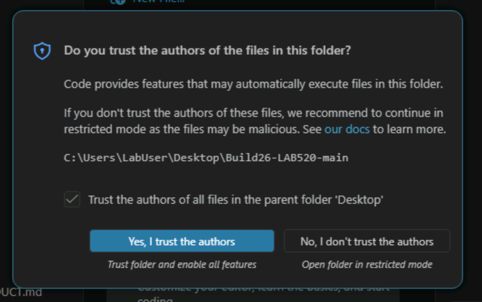

# Lab 2: Verify your Microsoft Foundry Project 

## Step 1: Verify in Foundry Portal

1. Open https://ai.azure.com in the browser
2. Sign in with your Azure credentials
3. You should see your project listed
4. Click into the project and verify:
   - The project endpoint matches your .env
   - Your model deployment appears under **Deployments**

---

## Step 2: Open the folder in VS Code and trust the workspace

Open Visual Studio Code

Launch VS Code from the Start menu or desktop.

Open the lab folder

In VS Code, select:

File → Open Folder

Navigate to:
C:\Users\LabUser\Desktop\Build26-LAB520-main

Click Select Folder

Alternative (faster option):

Open File Explorer
Go to:
C:\Users\LabUser\Desktop\Build26-LAB520-main

Right-click in the folder and choose Open with Code (if installed)

---

## Step 3: Trust the workspace



When prompted with "Do you trust the authors of the files in this folder?"
Click Yes, I trust the authors

Select Trust

Expected outcome

The folder opens in VS Code
All features (extensions, terminals, scripts) are fully enabled
No restricted mode warnings are shown

---

## Step 4. Validate your .env is created and populated


Ensure the .env file has been created in the root of your project.

```powershell
Test-Path .env
```
Compare .env against .env.sample

Validate that all required keys from .env.sample exist in .env.

Option A – Manual check
Open both files and confirm the following variables exist:

PROJECT_ENDPOINT
MODEL_DEPLOYMENT_NAME
MODEL_DEPLOYMENT_NAME_2 (optional)
AZURE_CONTAINER_REGISTRY_NAME (optional)

Option B - Automaed Check 

Copy and paste the following into powershell command window

```powershell

# Load sample keys
$sampleKeys = Get-Content .env.sample | Where-Object { $_ -match "=" } | ForEach-Object {
    ($_ -split "=")[0].Trim()
}

# Load env keys
$envKeys = Get-Content .env | Where-Object { $_ -match "=" } | ForEach-Object {
    ($_ -split "=")[0].Trim()
}

# Compare
$missingKeys = $sampleKeys | Where-Object { $_ -notin $envKeys }

if ($missingKeys.Count -eq 0) {
    Write-Host "✅ All required keys are present in .env"
} else {
    Write-Host "❌ Missing keys in .env:"
    $missingKeys
}
```

--- 

## Step 5: Validate Your Setup

Run the included validation script to confirm that all files, dependencies, CLI tools, and configuration are correct:

In Visual Studio Code Open a Terminal Window 

```bash
python -X utf8 src/tests/validate_lab.py
```

> **Note:** Use the -X utf8 flag on Windows to avoid encoding errors. On Linux/macOS you can omit it.

You should see output ending with:

```
  VALIDATION SUMMARY
  Total checks: 100
  Passed:  99
  Failed:  0
  Skipped: 1

  Result: PASS  - lab is ready!
```

If any checks fail, the output tells you exactly what to fix. Common issues:

| Failure | Fix |
|---------|-----|
| Missing file | Re-check your azd provision output for errors |
| CLI not found | Install the missing tool (see [SETUP.md](../setup/SETUP.md)) |
| Package not installed | Run pip install -r requirements.txt inside your .venv |
| .env not configured | Copy .env.sample to .env and fill in your endpoint |

> **Tip:** Re-run validation after any fix to confirm it resolves the issue.

---
## What You Learned

- ✅ How to validate your setup with the automated validation script
- ✅ Loading the workshop solution in VSCode


---

## Checkpoint

Before moving on, confirm all of the following:

- [ ] .env file exists and contains PROJECT_ENDPOINT and MODEL_DEPLOYMENT_NAME
- [ ] python -X utf8 src/tests/validate_lab.py shows all checks passing
- [ ] azd env get-values shows your project endpoint and resource group
- [ ] Your Foundry project is visible at https://ai.azure.com

If validation fails, check the failure messages -- common issues include missing .env values or incomplete provisioning.

---

## Key Takeaway

> A Foundry project is your workspace for organizing AI resources. The project endpoint is the single connection point your application code needs to access any model deployed within it.

---
**Next:** [Lab 3 - connect and inference](./lab3-connect-and-infer.md)