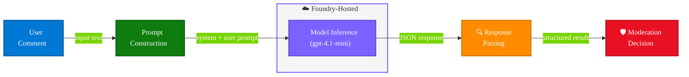

# Lab 4: Build a Comment Moderation Application

> **Duration:** ~20 minutes | **Phase:** Real-World Task Implementation

## Objective

Build a working comment moderation pipeline that accepts user-submitted comments, classifies them using a Foundry-hosted model, applies moderation logic, and outputs structured results.

---

## The Problem

Online platforms receive thousands of user comments. Manual review doesn't scale. You need an automated system that can:

1. Accept a comment as input
2. Classify it into a moderation category
3. Return a structured decision with reasoning
4. Handle edge cases gracefully

---

## Architecture



---

## Step 1: Review the System Prompt

The key to reliable moderation is a well-structured system prompt. Open `src/02_comment_moderation.py` and examine the `SYSTEM_PROMPT`:

```python
SYSTEM_PROMPT = """You are a content moderation system. Analyze the provided user comment and classify it.

Respond ONLY with valid JSON in this exact format:
{
    "classification": "<SAFE|NEEDS_REVIEW|UNSAFE>",
    "confidence": <0.0-1.0>,
    "reason": "<brief explanation>"
}

Classification rules:
- SAFE: Constructive feedback, questions, positive comments, neutral observations
- NEEDS_REVIEW: Borderline content, strong emotions, potential sarcasm, complaints without abuse
- UNSAFE: Hate speech, threats, harassment, explicit content, personal attacks

Do not include any text outside the JSON object."""
```

This prompt:

- **Constrains the output format** — JSON only, predictable structure
- **Defines clear categories** — three-tier classification
- **Provides classification rules** — reduces ambiguity
- **Eliminates free-text noise** — "Do not include any text outside the JSON"

---

## Step 2: Understand the Moderation Pipeline

The application follows this flow:

### 2a. Send Comment for Classification

```python
def classify_comment(client, model: str, comment: str) -> dict:
    try:
        response = client.chat.completions.create(
            model=model,
            messages=[
                {"role": "system", "content": SYSTEM_PROMPT},
                {"role": "user", "content": comment},
            ],
            temperature=0.0,  # Deterministic output
        )
    except Exception as e:
        if "content_filter" in str(e) or "content management policy" in str(e):
            return {
                "classification": "UNSAFE",
                "confidence": 1.0,
                "reason": "Blocked by Azure content safety filter.",
            }
        raise

    raw = response.choices[0].message.content.strip()
    try:
        result = json.loads(raw)
    except json.JSONDecodeError:
        result = {
            "classification": "NEEDS_REVIEW",
            "confidence": 0.0,
            "reason": f"Model returned non-JSON response: {raw[:100]}",
        }
    return result
```

Key design decisions:

| Decision | Rationale |
|----------|-----------|
| `temperature=0.0` | Same comment always gets the same classification |
| JSON output format | Machine-parseable, no regex needed |
| Structured system prompt | Reliable, consistent categorization |
| `try/except` around inference | Catches Azure content safety filter blocks gracefully |
| `try/except` around `json.loads()` | Falls back to `NEEDS_REVIEW` if the model returns malformed output |

### 2b. Apply Moderation Logic

```python
def apply_moderation(result: dict) -> str:
    classification = result["classification"]
    confidence = result["confidence"]

    if classification == "SAFE" and confidence >= 0.8:
        return "APPROVED"
    elif classification == "UNSAFE" and confidence >= 0.7:
        return "BLOCKED"
    else:
        return "FLAGGED_FOR_REVIEW"
```

This adds a **business logic layer** on top of the model's classification:

- High-confidence SAFE → auto-approve
- High-confidence UNSAFE → auto-block
- Everything else → human review queue

### 2c. Process Results

```python
def moderate_comment(client, model: str, comment: str) -> dict:
    classification = classify_comment(client, model, comment)
    action = apply_moderation(classification)
    return {
        "comment": comment,
        "classification": classification["classification"],
        "confidence": classification["confidence"],
        "reason": classification["reason"],
        "action": action,
    }
```

> **Note:** The `classify_comment` function uses `json.loads()` to parse the model's response. Because we set `temperature=0.0` and use a structured system prompt, the model reliably returns valid JSON. If you modify the prompt and see `json.JSONDecodeError`, check that your system prompt still instructs the model to respond in JSON format.

---

## Step 3: Run the Application

```bash
python src/02_comment_moderation.py
```

### Expected Output

```
========================================
  Comment Moderation System
  Model: gpt-4.1-mini
========================================

Processing 5 sample comments...

--- Comment 1/5 ---
Comment:  "Great article! Really helped me understand the basics."
Classification: SAFE (confidence: 0.95)
Reason:  Constructive positive feedback
Action:  ✅ APPROVED

--- Comment 2/5 ---
Comment:  "This is the worst product ever made by incompetent people"
Classification: NEEDS_REVIEW (confidence: 0.75)
Reason:  Strong negative sentiment with borderline personal attack
Action:  🔍 FLAGGED_FOR_REVIEW

--- Comment 3/5 ---
Comment:  "You are an idiot and everyone who uses this is stupid"
Classification: UNSAFE (confidence: 0.95)
Reason:  Contains personal attacks and insults
Action:  🚫 BLOCKED

--- Comment 4/5 ---
Comment:  "Could you explain step 3 in more detail?"
Classification: SAFE (confidence: 0.98)
Reason:  Constructive question seeking clarification
Action:  ✅ APPROVED

--- Comment 5/5 ---
Comment:  "Meh, I've seen better. Not terrible though."
Classification: SAFE (confidence: 0.82)
Reason:  Neutral observation with mild criticism
Action:  ✅ APPROVED

========================================
  Summary
========================================
Total comments: 5
  APPROVED:          3
  FLAGGED_FOR_REVIEW: 1
  BLOCKED:           1
```

> **Note:** Some test comments containing threats or explicit content may be blocked by Azure's built-in content safety filter *before* reaching the model. When this happens, the application handles it gracefully and labels the comment as `UNSAFE` with a "Blocked by Azure content safety filter" reason. This is expected behavior — the content filter is an additional layer of protection in production deployments.

---

## Step 4: Test with Custom Comments

The application also accepts interactive input. Run it with the `--interactive` flag:

```bash
python src/02_comment_moderation.py --interactive
```

Type comments to classify them in real time:

```
Enter a comment (or 'quit' to exit): Your tutorial is missing important context
Classification: NEEDS_REVIEW (confidence: 0.65)
Reason: Feedback that could be constructive or complaining
Action: 🔍 FLAGGED_FOR_REVIEW
```

---

## Step 5: Test with the Sample Dataset

The `src/sample_comments.json` file contains a broader set of test comments. Run the batch test:

```bash
python src/02_comment_moderation.py --file src/sample_comments.json
```

---

## Step 6: Customize the Moderation Logic

Try adjusting the confidence thresholds in the `apply_moderation` function:

| Threshold Change | Effect |
|-----------------|--------|
| Lower SAFE threshold (0.8 → 0.6) | More comments auto-approved |
| Raise UNSAFE threshold (0.7 → 0.9) | Fewer auto-blocks, more human review |
| Add a NEEDS_REVIEW handler | Custom routing for borderline content |

---

## What You Learned

- ✅ How to design a system prompt for structured output (JSON)
- ✅ How to build a classification pipeline using model inference
- ✅ How to apply business logic on top of model responses
- ✅ How to process batches of content programmatically
- ✅ How to handle interactive input for real-time moderation

---

## Checkpoint

Before moving on, confirm:

- [ ] `python src/02_comment_moderation.py` classifies all 5 sample comments without errors
- [ ] You see all three action types: APPROVED, FLAGGED_FOR_REVIEW, and BLOCKED
- [ ] `python src/02_comment_moderation.py --file src/sample_comments.json` processes all 15 comments

If classifications seem inconsistent, verify you are using `temperature=0.0` in your requests.

---

## Key Takeaway

> A model provides the intelligence — your application provides the logic. By combining a structured prompt with deterministic settings and programmatic decision-making, you can build production-quality moderation systems without any fine-tuning.

---

## Optional: Write a Unit Test for the Moderation Logic

The validation script (`src/tests/validate_lab.py`) tests setup and end-to-end inference, but it doesn't unit-test the business logic in isolation. Here's a quick pattern you can use to test `apply_moderation` without calling the model:

```python
# test_moderation.py — run with: python test_moderation.py
import sys
sys.path.insert(0, "src")
from importlib import import_module
mod = import_module("02_comment_moderation")

def test_apply_moderation():
    # High-confidence SAFE → APPROVED
    assert mod.apply_moderation({"classification": "SAFE", "confidence": 0.95}) == "APPROVED"
    # Low-confidence SAFE → FLAGGED
    assert mod.apply_moderation({"classification": "SAFE", "confidence": 0.5}) == "FLAGGED_FOR_REVIEW"
    # High-confidence UNSAFE → BLOCKED
    assert mod.apply_moderation({"classification": "UNSAFE", "confidence": 0.9}) == "BLOCKED"
    # Low-confidence UNSAFE → FLAGGED
    assert mod.apply_moderation({"classification": "UNSAFE", "confidence": 0.3}) == "FLAGGED_FOR_REVIEW"
    # NEEDS_REVIEW always → FLAGGED
    assert mod.apply_moderation({"classification": "NEEDS_REVIEW", "confidence": 0.8}) == "FLAGGED_FOR_REVIEW"
    print("All tests passed!")

test_apply_moderation()
```

This tests the **business logic** independently from the model — you can run it offline, in CI, and with no Azure credentials. It validates that your confidence thresholds route comments correctly.

### pytest Version

If you're familiar with `pytest`, here's the same coverage as a proper test module. Create `src/tests/test_moderation.py`:

```python
# src/tests/test_moderation.py — run with: pytest src/tests/test_moderation.py -v
import sys
sys.path.insert(0, "src")
from importlib import import_module

mod = import_module("02_comment_moderation")
apply_moderation = mod.apply_moderation
classify_comment = mod.classify_comment


class TestApplyModeration:
    """Unit tests for the business-logic layer (no model calls)."""

    def test_safe_high_confidence_approved(self):
        assert apply_moderation({"classification": "SAFE", "confidence": 0.95}) == "APPROVED"

    def test_safe_low_confidence_flagged(self):
        assert apply_moderation({"classification": "SAFE", "confidence": 0.5}) == "FLAGGED_FOR_REVIEW"

    def test_safe_at_threshold_approved(self):
        assert apply_moderation({"classification": "SAFE", "confidence": 0.8}) == "APPROVED"

    def test_unsafe_high_confidence_blocked(self):
        assert apply_moderation({"classification": "UNSAFE", "confidence": 0.9}) == "BLOCKED"

    def test_unsafe_low_confidence_flagged(self):
        assert apply_moderation({"classification": "UNSAFE", "confidence": 0.3}) == "FLAGGED_FOR_REVIEW"

    def test_unsafe_at_threshold_blocked(self):
        assert apply_moderation({"classification": "UNSAFE", "confidence": 0.7}) == "BLOCKED"

    def test_needs_review_always_flagged(self):
        assert apply_moderation({"classification": "NEEDS_REVIEW", "confidence": 0.99}) == "FLAGGED_FOR_REVIEW"

    def test_missing_classification_flagged(self):
        assert apply_moderation({"confidence": 0.9}) == "FLAGGED_FOR_REVIEW"

    def test_missing_confidence_flagged(self):
        assert apply_moderation({"classification": "SAFE"}) == "FLAGGED_FOR_REVIEW"
```

Run it with:

```bash
pytest src/tests/test_moderation.py -v
```

Expected output:

```
src/tests/test_moderation.py::TestApplyModeration::test_safe_high_confidence_approved PASSED
src/tests/test_moderation.py::TestApplyModeration::test_safe_low_confidence_flagged PASSED
src/tests/test_moderation.py::TestApplyModeration::test_safe_at_threshold_approved PASSED
...
9 passed in 0.02s
```

> **Why pytest?** It discovers tests automatically, gives clear failure diffs, and integrates with CI pipelines (GitHub Actions, Azure DevOps). The standalone script above is simpler to run; `pytest` is what you'd use in a real project.

---

**Next:** [Lab 5 - Model Comparison (Optional Extension) →](lab5-model-comparison.md)
