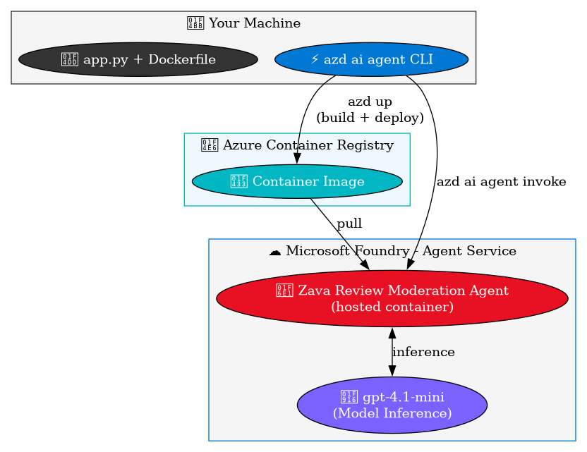

# Lab 6: Deploy a Hosted Agent with the AZD AI CLI

> **Duration:** ~20 minutes | **Phase:** Final Solution -- Hosted Agent Deployment

## Objective

Deploy Zava's product review moderation logic from Lab 4 as a **hosted agent** on Microsoft Foundry Agent Service using the Azure Developer CLI (azd ai agent). This turns Serena's local Python script into a persistent, cloud-hosted service that can scale to handle Zava's daily review volume. The entire workflow -- initialization, build, deploy, invoke, monitor, and cleanup -- is driven by CLI commands.

---

## What is a Hosted Agent?

A **hosted agent** is a containerized application that runs on Foundry's managed infrastructure:

| Property | Description |
|----------|-------------|
| **Runtime** | Your code in a Docker container, managed by Foundry |
| **Adapter** | Hosting adapter exposes your agent as a REST API |
| **Protocol** | OpenAI Responses API compatible |
| **Scaling** | Automatic (configurable min/max replicas) |
| **Lifecycle** | init → deploy → invoke → monitor → cleanup via azd |
| **Identity** | Project managed identity (auto-configured) |

Unlike the scripts in Labs 3-5 which run locally, a hosted agent is a **persistent, cloud-hosted service** accessible from the Foundry Playground, other agents, or any application.

---

## Architecture



---

## What's New in This Lab

Labs 3-4 were pure Python -- you wrote a script, ran it locally, and saw output in your terminal. This lab introduces **three new concepts**, but do not worry: azd handles the heavy lifting for all of them.

| New concept | What it means | What you actually do |
|---|---|---|
| **Docker container** | Your agent code is packaged into a portable image | **azd up** builds it for you -- you do not write or run any Docker commands |
| **Azure Container Registry (ACR)** | Cloud storage for container images | Already provisioned in Lab 2 -- azd pushes to it automatically |
| **Hosted agent on Foundry** | A persistent REST API running your moderation logic | **azd up** deploys it; **azd ai agent invoke** calls it |

The bottom line: you will edit zero infrastructure files. The commands are **azd up** (deploy) and **azd ai agent invoke** (test).

---

## Prerequisites

- Labs 1-4 completed (Foundry project provisioned, model deployed)
- Azure Developer CLI installed with the ai agent extension:
  ```bash
  azd ext install azure.ai.agents
  azd ext upgrade azure.ai.agents
  ```
- .env file with PROJECT_ENDPOINT and MODEL_DEPLOYMENT_NAME set

> **From Lab 4 to hosted agent:** In Labs 3-4, you built Zava's review moderation pipeline that runs locally -- you send a product review, the model classifies it, and your code applies business logic. In this lab, you take that same moderation logic and deploy it as a **hosted agent** on Foundry. The agent runs in a managed container, is accessible via REST API, and can be used from the Foundry Playground, other agents (like Cora, Zava's shopping assistant), or any application. Same intelligence, now as a persistent cloud service.

---

## Step 1: Review the Agent Code

The agent source code lives in src/agent/. Three files make up the hosted agent app.py, dockerfile and agent.yml:

### src/agent/app.py -- The Agent

```python
from agent_framework import Agent
from agent_framework_foundry import FoundryChatClient
from agent_framework_foundry_hosting import ResponsesHostServer
from azure.identity import DefaultAzureCredential
....

Do not include any text outside the JSON object."""

agent = Agent(
    client=FoundryChatClient(
        project_endpoint=PROJECT_ENDPOINT,
        model=MODEL_DEPLOYMENT_NAME,
        credential=DefaultAzureCredential(),
    ),
    name="zava-review-moderation-agent",
    instructions=SYSTEM_PROMPT,  # Same Zava review moderation prompt from Lab 4
)

if __name__ == "__main__":
    ResponsesHostServer(agent).run(port=8088)
```

Key components:
- **Agent** from Microsoft Agent Framework -- defines the agent's behavior
- **FoundryChatClient** -- connects to Foundry for model inference using the current Agent Framework sample pattern
- **ResponsesHostServer(agent).run(port=8088)** -- the Foundry hosting adapter wraps your agent as an HTTP server on port 8088

### src/agent/Dockerfile -- Container Definition

```dockerfile
FROM python:3.12-slim
WORKDIR /app
COPY requirements.txt .
RUN pip install --no-cache-dir -r requirements.txt
COPY . .
EXPOSE 8088
CMD ["python", "-u", "app.py"]
```

### src/agent/agent.yaml -- Agent Manifest

```yaml
kind: hosted
name: zava-review-moderation-agent
description: Product review moderation agent for Zava that classifies customer reviews
protocols:
    - protocol: responses
      version: "1.0.0"
environment_variables:
    - name: AZURE_AI_PROJECT_ENDPOINT
      value: ${AZURE_AI_PROJECT_ENDPOINT}
    - name: AZURE_AI_MODEL_DEPLOYMENT_NAME
      value: ${MODEL_DEPLOYMENT_NAME}
```

The manifest tells Foundry how to configure Zava's review moderation agent -- which protocols it supports and what environment variables to inject.

---

## Step 2: Initialize the Project (Optional -- Already Done)

> **Note:** The repo already includes the agent files and azure.yaml configuration. This step shows how it was set up, for reference.

If you were starting from scratch, you would run:

**Bash (Mac/Linux):**

```bash
azd ai agent init \
    --project-id "<your-foundry-project-resource-id>" \
    --model-deployment gpt-4.1-mini \
    --protocol responses \
    --src src/agent
```

**PowerShell (Windows):**

```powershell
azd ai agent init `
    --project-id "<your-foundry-project-resource-id>" `
    --model-deployment gpt-4.1-mini `
    --protocol responses `
    --src src/agent
```

This command:
1. Detects your existing Foundry project and ACR
2. Generates agent.yaml with the agent manifest
3. Registers the agent as a service in azure.yaml
4. Sets all required azd environment variables

---

## Step 3: Test the Agent Locally

Before deploying to the cloud, validate that the agent runs correctly on your machine. This catches import errors, configuration issues, and logic bugs early.

### Install Agent Dependencies

The agent uses packages that are separate from the main lab requirements. Install them first:

```bash
pip install -r src/agent/requirements.txt
```

### Start the Agent

Open a terminal, activate your virtual environment, and run:

```bash
cd src/agent
python app.py
```

You should see output like:

```
Starting Zava product review moderation agent...
  Endpoint: https://<your-resource>.services.ai.azure.com/api/projects/<your-project>
  Model:    gpt-4.1-mini
Starting hosting adapter on port 8088...
INFO:     Uvicorn running on http://0.0.0.0:8088 (Press CTRL+C to quit)
```

### Send a Test Request

Open a **second terminal** and send a test comment to the locally running agent:

**PowerShell:**

```powershell
Invoke-RestMethod -Uri "http://localhost:8088/responses" `
    -Method POST -ContentType "application/json" `
    -Body '{"input": "Love this cordless drill! Battery lasts all day and the torque is impressive.", "model": "gpt-4.1-mini"}' | ConvertTo-Json -Depth 10
```

**Bash / curl:**

```bash
curl -s http://localhost:8088/responses \
    -H "Content-Type: application/json" \
    -d '{"input": "Love this cordless drill! Battery lasts all day and the torque is impressive.", "model": "gpt-4.1-mini"}' | python -m json.tool
```

### Expected Response

Look for the output_text field in the response -- it should contain a JSON classification:

```json
{
    "classification": "SAFE",
    "confidence": 1.0,
    "reason": "Positive and constructive product feedback about a cordless drill."
}
```

### Test an Unsafe Review

```bash
curl -s http://localhost:8088/responses \
    -H "Content-Type: application/json" \
    -d '{"input": "Zava employees are the worst people on earth", "model": "gpt-4.1-mini"}'
```

Expected: "classification": "UNSAFE"

### Alternatively, Use the CLI

If you prefer, use **azd ai agent invoke** with the **--local** flag:

```bash
azd ai agent invoke --local "The cabinet hardware feels cheap for the price Zava is charging"
```

> **Troubleshooting:** If you see ImportError, make sure your virtual environment is activated and the packages from src/agent/requirements.txt are installed:
> ```bash
> pip install -r src/agent/requirements.txt
> ```

Once you've confirmed the agent works locally, press **Ctrl+C** to stop it and proceed to cloud deployment.

---

## Step 4: Deploy the Agent

Build the container image in ACR and deploy the hosted agent to Foundry:

```bash
azd up
```
If you get the error: "ERROR: FOUNDRY_PROJECT_ENDPOINT is required: environment variable was not found in the current azd environment"

run 
```bash 
azd env set FOUNDRY_PROJECT_ENDPOINT "https://<your-foundry-project-endpoint>"
```
You get your endpoint from the config page at https://ai.azure.com/ for the project. 

Now re-run to deploy

```bash
azd up 
```

### What azd up Does

1. **Provisions** -- Creates/updates infrastructure (ACR, capability host, RBAC)
2. **Builds** -- Sends src/agent/ to ACR for a remote Docker build
3. **Deploys** -- Registers a hosted agent version on Foundry Agent Service
4. **Starts** -- Launches the container and waits for it to be ready

### Expected Output

```
Provisioning Azure resources (azd provision)
...
(✓) Done: Resource group: rg-<your-resource-group>

Deploying services (azd deploy)
  Building container image...
  (✓) Done: Container image built and pushed to ACR
  Creating hosted agent version...
  (✓) Done: Agent deployed and started

SUCCESS: Your application was provisioned and deployed to Azure.
```

> The first deployment takes 3-5 minutes. Subsequent deployments are faster.

---

## Step 5: Check Agent Status

Verify the agent is running:

```bash
azd ai agent show
```

Use table format for the clearest status view:

```bash
azd ai agent show --output table
```

Expected output includes:

```text
FIELD    VALUE
-----    -----
Name     zava-review-moderation-agent
Version  <latest-version>
Status   active
```

---

## Step 6: Invoke the Agent

Send messages to your hosted agent directly from the CLI:

```bash
azd ai agent invoke "Love this cordless drill! Battery lasts all day and the torque is impressive."
```

### Expected Output

```json
{
  "classification": "SAFE",
  "confidence": 1.0,
  "reason": "Positive and constructive product feedback."
}
```

Try more examples:

```bash
azd ai agent invoke "This paint is garbage and whoever designed it should be fired"
```

```bash
azd ai agent invoke "Zava employees are the worst people on earth"
```

```bash
azd ai agent invoke "Does this deck stain work on pressure-treated lumber?"
```

### Conversations

By default, **azd ai agent invoke** reuses the same conversation session. To start fresh:

```bash
azd ai agent invoke --new-session "Fresh conversation here"
```

---

## Step 7: Test in the Microsoft Foundry Playground

The Foundry Playground at +++https://ai.azure.com+++ lets you interact with your deployed agent through a chat-style UI -- no CLI or code required. This is useful for quick testing, demos, and validating prompt behavior.

### 7.1 -- Open the Playground

1. Open in the browser +++https://ai.azure.com+++ and sign in with the same account used for **azd**
2. In the top navigation, select your **build**. If you do not see it, click **All projects** and find it under your AI Services resource
3. In the left sidebar, click **Agents**
4. Find **zava-review-moderation-agent** in the agent list -- its status should show **Started**
5. Click the agent name to open its detail page
6. Click the **Try in Playground** button (or the **Playground** tab) to open the interactive chat UI

> **Tip:** After **azd deploy**, the output includes a direct portal link. You can also get it with:
> ```bash
> azd ai agent show
> ```
> Look for the **playground** URL in the output.

### 7.2 -- Test Classification Prompts

In the Playground chat box, type a comment and press **Send**. The agent responds with a JSON classification.

Try these test prompts to validate each classification category:

| Prompt to send | Expected classification |
|---|---|
| Love this cordless drill! Battery lasts all day.` | **SAFE** |
| The tile cutter is mediocre, I expected more for the price. | **SAFE** |
| I think this review contains sensitive personal data: SSN 123-45-6789 | **NEEDS_REVIEW** |
| Zava employees are the worst people on earth | **UNSAFE** 
| Does this deck stain work on pressure-treated lumber? | **SAFE** |

Each response should contain a structured JSON object:

```json
{
    "classification": "SAFE",
    "confidence": 1.0,
    "reason": "Positive and constructive product feedback about a cordless drill."
}
```

### 7.3 -- Review the System Prompt

The Playground shows the agent's **system prompt** (instructions) that drives the classification behavior:

1. In the Playground view, look for the **System prompt** or **Instructions** panel (usually on the right side or in the agent settings)
2. Verify it contains the Zava review moderation instructions -- the rules for classifying reviews as SAFE, NEEDS_REVIEW, or UNSAFE
3. This is the same prompt defined in src/agent/app.py as SYSTEM_PROMPT

> **Note:** The system prompt is read-only in the Playground for hosted agents -- it is baked into the container code. To change it, edit app.py and redeploy with azd deploy.

### 7.4 -- Inspect Conversation History

The Playground maintains conversation history within a session:

1. Send several prompts in sequence -- the chat window shows the full exchange
2. Each agent response appears as a message with the JSON classification
3. Click **New conversation** (or the **+** button) to start a fresh session -- useful when testing the same prompt multiple times to check consistency
4. Previous sessions are listed in the left panel -- click any session to review past interactions

### 7.5 -- Validate Edge Cases

Use the Playground to quickly test edge cases and boundary conditions:

```
Empty review:
(just press Send with no text)

Ambiguous tone:
"Wow, what a 'great' product selection you have here"

Mixed content:
"The drill is excellent but the store staff are completely useless and incompetent"

Non-English:
"Este taladro es terrible y la tienda es un desastre"
```

Check that the agent returns valid JSON for every input and that the **confidence** score reflects ambiguity (lower confidence for borderline cases).

> **Troubleshooting:** If the Playground shows the agent as **Stopped** or **Activating**, wait 1-2 minutes -- the container may still be starting. Check status with azd ai agent show --output table from the CLI.

---

## Step 8: Monitor Logs

To monitor a specific interaction, first create a session and invoke the agent:

**Bash (Mac/Linux):**

```bash
SESSION_ID=$(uuidgen)

azd ai agent invoke "Hello" --session-id $SESSION_ID
```

**PowerShell (Windows):**

```powershell
$SESSION_ID = [System.Guid]::NewGuid().ToString()

azd ai agent invoke "Hello" --session-id $SESSION_ID
```

Then stream logs for that session in real time:

**Bash (Mac/Linux):**

```bash
azd ai agent monitor --session-id $SESSION_ID
```

**PowerShell (Windows):**

```powershell
azd ai agent monitor --session-id $SESSION_ID
```

Additional Monitoring Options

Stream the agent's container logs:

```bash
azd ai agent monitor 
```

For system events (container lifecycle):

```bash
azd ai agent monitor --type system
```

To stream logs continuously:

```bash
azd ai agent monitor --follow
```

> Open a second terminal for log monitoring while you invoke the agent in the first.

---

## Step 9: Clean Up

When you are done, clean up all Azure resources:

```bash
azd down
```

This removes:
- The hosted agent deployment
- The container image in ACR
- Any infrastructure provisioned by **azd up**

> To just stop the agent without deleting everything, use the Foundry portal or az cognitiveservices agent stop.

---

## CLI Command Reference

| Command | Purpose |
|---------|---------|
| azd ai agent init | Scaffold a new hosted agent project |
| azd up | Provision + build + deploy (all-in-one) |
| azd deploy | Rebuild and redeploy (skip provisioning) |
| azd ai agent show | Check agent status |
| azd ai agent invoke "msg" | Send a message to the agent |
| azd ai agent invoke --local "msg" | Test against a locally running agent |
| azd ai agent run | Run the agent locally for development |
| azd ai agent monitor | Stream container logs |
| azd down | Delete all resources |

---

## Stretch Goal: Add a SPAM Category

Want to extend the agent before wrapping up? Try adding a fourth classification category:

1. **Edit the system prompt** in src/agent/app.py -- add SPAM to the list of valid classifications, with a description like: *"SPAM: Promotional, advertising, or off-topic content unrelated to the product being reviewed."*
2. **Update the business logic** -- decide what action SPAM reviews should get (e.g., FLAGGED_FOR_REVIEW or a new QUARANTINED action)
3. **Redeploy** -- run azd deploy to push your changes to the hosted agent
4. **Test** -- invoke the agent with a spammy review:
   ```bash
   azd ai agent invoke "Buy cheap sunglasses at www.example.com! 50% off today only!"
   ```
5. Verify the response includes "classification": "SPAM"`

This exercise reinforces the full edit → deploy → test cycle you'd use in production.

---

## Checkpoint

Before moving on, confirm:

- [ ] azd ai agent show --output table shows **Status: active**
- [ ] azd ai agent invoke "Love this cordless drill!" returns a JSON response with "classification": "SAFE"
- [ ] The agent is visible in the Foundry Playground at +++https://ai.azure.com+++

If the agent status shows an error, check the logs with azd **ai agent monitor** for details.

---

## What You Learned

- ✅ How hosted agents package your code as managed containers on Foundry
- ✅ How the Foundry hosting adapter (**ResponsesHostServer**) turns your agent into an API
- ✅ How **azd ai agent init** scaffolds and configures a hosted agent project
- ✅ How **azd up** handles the entire build → deploy → start lifecycle
- ✅ How to invoke, monitor, and manage hosted agents via the CLI

---

## Key Takeaway

> The Zava review moderation pipeline from Lab 4 is now a **production-ready hosted agent** on Microsoft Foundry. Using the **azd ai agent** CLI, the entire workflow -- from initialization to deployment to invocation -- is just a few terminal commands. No manual Docker builds, no SDK deployment scripts, no infrastructure management.

---

**Next:** [Lab 7: Workshop Summary](./lab7-summary.md) 
