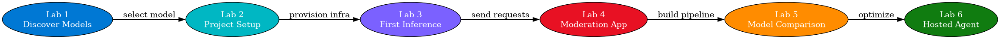

# Lab 7: Resumo do Workshop e Resultados de Aprendizagem

> **Duração:** ~10 minutos | **Fase:** Reflexão e Revisão

## Objetivo

Revisar a jornada completa do descobrimento de um modelo no catálogo Foundry até a implantação de um agente hospedado pronto para produção para moderação de avaliações de produtos da Zava. Este lab consolida o que você construiu, as habilidades que adquiriu e para onde ir em seguida.

---

## Duração Total do Workshop

| Lab | Título | Duração |
|-----|--------|---------|
| 1 | Descobrir Modelos no Microsoft Foundry | ~10 min |
| 2 | Criar e Configurar um Projeto Foundry | ~15 min |
| 3 | Conectar e Enviar Sua Primeira Inferência | ~15 min |
| 4 | Construir uma Aplicação de Moderação de Avaliações de Produtos para Zava | ~20 min |
| 5 | Comparar Resultados de Modelos *(opcional)* | ~15 min |
| 6 | Implantar um Agente Hospedado | ~20 min |
| 7 | Resumo do Workshop e Resultados de Aprendizagem | ~10 min |
| | **Labs principais (1-4, 6-7)** | **~90 min** |
| | **Todos os labs incluindo Lab 5 opcional** | **~105 min** |

---

## O Que Você Construiu

Ao longo de seis labs, você -- como Serena, uma desenvolvedora na Zava -- construiu um **pipeline de moderação de avaliações de produtos** end-to-end, de um terminal em branco a um agente em nuvem hospedado acessível via API REST:

---

## Recapitulação Lab-por-Lab

### Lab 1: Descobrir Modelos no Microsoft Foundry

| | |
|---|---|
| **O que você fez** | Navegou pelo catálogo de modelos Foundry, avaliou propriedades do modelo, testou prompts de moderação de avaliações da Zava no Playground |
| **Habilidade-chave** | Selecionando o modelo correto para uma tarefa com base em capacidades, preço e quotas |
| **Resultado** | Escolheu **gpt-4.1-mini** como o modelo para moderação de avaliações da Zava |

**Conceito central:** Nem todos os modelos são iguais -- tipo de tarefa, latência, custo e disponibilidade de região todos afetam a seleção de modelo para cargas de trabalho empresariais como a Zava.

---

### Lab 2: Criar e Configurar um Projeto Foundry

| | |
|---|---|
| **O que você fez** | Provisionou um ambiente Azure completo com **azd** -- conta de Serviços de IA, projeto Foundry, implantação de modelo, monitoramento e RBAC |
| **Habilidade-chave** | Infraestrutura como Código com Bicep, configuração de ambiente com **azd** |
| **Resultado** | Um projeto Foundry totalmente provisionado com um modelo implantado e configuração local **.env** |

**Conceito central:** **azd** gerencia o ciclo de vida completo -- do provisionamento de infraestrutura às variáveis de ambiente -- para que você nunca toque o portal para implantação.

---

### Lab 3: Conectar e Enviar Sua Primeira Inferência

| | |
|---|---|
| **O que você fez** | Escreveu código Python para se autenticar com **DefaultAzureCredential** e enviar uma solicitação de conclusão de bate-papo |
| **Habilidade-chave** | Usando o SDK de Projetos de IA do Azure para inferência de modelo, compreendendo funções de mensagem e uso de token |
| **Resultado** | Um script funcional (src/01_first_inference.py) que envia prompts e recebe respostas de modelo |

**Conceito central:** Conclusões de bate-papo usam um array de mensagem com funções sistema/usuário. A mensagem do sistema molda o comportamento do modelo; a mensagem do usuário é a entrada.

---

### Lab 4: Construir uma Aplicação de Moderação de Avaliações de Produtos para Zava

| | |
|---|---|
| **O que você fez** | Projetou um prompt do sistema para classificação JSON estruturada de avaliações de produtos da Zava, construiu uma camada de lógica de negócios com limites de confiança, processou lotes de avaliações |
| **Habilidade-chave** | Engenharia de prompt para saída estruturada, construindo lógica de decisão ao redor de respostas de modelo |
| **Resultado** | Um app de moderação completo (src/02_comment_moderation.py) que classifica avaliações de produtos da Zava como SAFE, NEEDS_REVIEW ou UNSAFE |

**Conceito central:** O valor real está na combinação de prompt do sistema + lógica de negócios. O modelo fornece classificação; seu código toma as decisões.

---

### Lab 5: Comparar Resultados de Modelos

| | |
|---|---|
| **O que você fez** | Executou os mesmos prompts de moderação de avaliações da Zava através de gpt-4.1-mini e gpt-4.1, comparou qualidade, latência e custo |
| **Habilidade-chave** | Avaliação de múltiplos modelos, análise de trade-off custo-desempenho, padrões de escalação híbrida |
| **Resultado** | Um script de comparação (src/03_model_comparison.py) com resultados lado-a-lado e um modo de roteamento híbrido opcional |

**Conceito central:** Modelos mais baratos frequentemente têm desempenho bom o suficiente para a maioria das entradas. Reserve modelos caros para casos de baixa confiança -- isso reduz custos mantendo qualidade.

---

### Lab 6: Implantar um Agente Hospedado

| | |
|---|---|
| **O que você fez** | Empacotou a lógica de moderação de avaliações da Zava como um conteiner Docker, implantou no Serviço de Agente Foundry com **azd up**, testou via CLI e Playground Foundry |
| **Habilidade-chave** | Implantação de agente contêinerizado, SDK do Agent Framework, gerenciamento de ciclo de vida de agente hospedado |
| **Resultado** | Um agente de moderação de avaliações da Zava ao vivo hospedado na nuvem acessível via API de Respostas do OpenAI |

**Conceito central:** Um agente hospedado transforma o código Python local de Serena em um serviço gerenciado e escalável -- sem gerenciamento de infraestrutura, apenas azd up.

---

## Habilidades Adquiridas

Ao completar este workshop, você ganhou experiência prática com:

### Azure & Infraestrutura
- Navegando no portal Microsoft Foundry e catálogo de modelos
- Provisionando infraestrutura com Bicep e **azd**
- Gerenciando recursos do Azure (Serviços de IA, ACR, RBAC, monitoramento)
- Compreendendo arquitetura de projeto Foundry (contas, projetos, implantações, hosts de capacidade)

### Python & Desenvolvimento de IA
- Autenticando com **DefaultAzureCredential** (sem chaves codificadas)
- Enviando solicitações de conclusão de bate-papo via SDK de Projetos de IA do Azure
- Engenharia de prompt do sistema para saída JSON estruturada
- Construindo lógica de negócios ao redor de respostas de modelo
- Comparando múltiplos modelos em tarefas idênticas

### Desenvolvimento de Agente & Implantação
- Usando o Microsoft Agent Framework (Agent, FoundryChatClient)
- Escrevendo um manifesto Dockerfile e agent.yaml
- Teste local antes da implantação na nuvem
- Implantando agentes contêinerizados no Serviço de Agente Foundry
- Invocando e monitorando agentes via CLI azd ai agent
- Testando agentes no Playground Foundry

---

## Visão Geral de Arquitetura

O sistema final que você construiu abrange desenvolvimento local e serviços em nuvem do Azure:

---

## Arquivos-Chave Que Você Criou ou Modificou

| Arquivo | Propósito | Lab |
|---------|-----------|-----|
| src/01_first_inference.py | Primeira solicitação de conclusão de bate-papo | Lab 3 |
| src/02_comment_moderation.py | Pipeline de moderação completo com modos lote + interativo | Lab 4 |
| src/03_model_comparison.py | Avaliação lado-a-lado de modelos | Lab 5 |
| src/agent/app.py | Agente hospedado com SDK do Agent Framework | Lab 6 |
| src/agent/agent.yaml | Manifesto de agente (protocolos, variáveis env) | Lab 6 |
| src/agent/Dockerfile | Definição de conteiner para o agente | Lab 6 |
| src/agent/requirements.txt | Dependências Python para o agente | Lab 6 |
| .env | Configuração de ambiente local | Lab 2 |
| azure.yaml | Configuração de projeto azd | Lab 2 |
| infra/main.bicep | Orquestração de infraestrutura | Lab 2 |
| infra/modules/ai-services.bicep | Serviços de IA, projeto, modelo, ACR, host de capacidade | Lab 2 |

---

## Padrões-Chave e Conceitos-Chave

### 1. Engenharia de Prompt Dirige Comportamento

O prompt do sistema é a peça mais importante da sua aplicação. Um prompt bem-estruturado com instruções claras de formato de saída (SAFE/NEEDS_REVIEW/UNSAFE com schema JSON) transforma um modelo de propósito geral em um classificador especializado.

### 2. Lógica de Negócios Envolve Saída de Modelo

Modelos fornecem saída probabilística -- seu código toma decisões determinísticas. O padrão de limite de confiança (aprovar automaticamente acima de 0.85, bloquear abaixo, sinalizar para revisão no meio) é reutilizável em muitas aplicações de IA.

### 3. Comece Barato, Escalone Inteligentemente

O padrão de modelo híbrido do Lab 5 aplica-se amplamente: use um modelo rápido e barato para a maioria das solicitações e apenas rotear casos de baixa confiança para um modelo mais capaz (e caro). Isto pode reduzir custos em 60-80% com impacto mínimo de qualidade.

### 4. Local Primeiro, Nuvem Segundo

Sempre teste localmente antes de implantar. O fluxo de trabalho python app.py → curl localhost:8088 detecta problemas que são muito mais difíceis de depurar na nuvem.

### 5. Infraestrutura como Código, Sempre

Cada recurso do Azure neste workshop é definido em Bicep e gerenciado por azd. Isto significa que todo o ambiente é reproduzível, versionado e deletável com um único comando (azd down).

---

## Comandos CLI Usados

Uma referência completa de cada comando CLI usado ao longo do workshop:

| Comando | Lab | Propósito |
|---------|-----|-----------|
| azd init | 2 | Inicializar o projeto azd |
| azd provision | 2 | Provisionar infraestrutura do Azure |
| azd env set | 2 | Definir variáveis de ambiente |
| azd env get-values | 2 | Visualizar configuração de ambiente atual |
| python src/01_first_inference.py | 3 | Executar script de primeira inferência |
| python src/02_comment_moderation.py | 4 | Executar pipeline de moderação |
| python src/03_model_comparison.py | 5 | Executar comparação de modelos |
| python src/agent/app.py` | 6 | Executar agente localmente |
| azd up | 6 | Provisionar + construir + implantar |
| azd deploy | 6 | Reconstruir e reimplantar |

---

## Próximos Passos

### Para Aprender Mais

1. **Microsoft Foundry Docs** -- https://aka.ms/foundry-docs
   - Construir agentes customizados com o Agent Framework
   - Integrar o Foundry com suas aplicações próprias
   - Melhores práticas para implantação em produção

2. **Azure AI SDK Python** -- https://github.com/Azure/azure-sdk-for-python
   - Referência completa da API AIProjectClient
   - Exemplos de conclusão de bate-papo avançada
   - Padrões para streaming e respostas longas

3. **Azure Developer CLI** -- https://learn.microsoft.com/cli/azure/what-is-azure-cli
   - Referência completa de comando azd
   - Publicação de aplicações web e APIs
   - Gerenciamento de ambientes locais e na nuvem

### Expandir o Projeto Zava

Com seu pipeline de moderação funcionando, considere:

- **Integração com banco de dados** -- Armazene avaliações, classificações e ações em Azure Cosmos DB ou SQL
- **Fila de revisão humana** -- Use Azure Service Bus para rotear comentários FLAGGED_FOR_REVIEW para sua equipe de confiança e segurança
- **Monitoramento e alertas** -- Configure Application Insights para rastrear taxa de aprovação, tempo de latência e erros
- **Feedback loop** -- Permita que revisores humanos reclassifiquem comentários para treinar próximas versões
- **Multi-idioma** -- Estenda a moderação além do inglês (dica: gpt-4.1-mini suporta 100+ idiomas)
- **Moderação em tempo real** -- Integre com sua API de avaliações para bloquear comentários UNSAFE antes da publicação

---

## Reflexão

Você percorreu a jornada de um desenvolvedor moderno de IA em um workshop de 90 minutos:

- **Lab 1:** Você explorou um novo mundo de modelos hospedados disponíveis sob demanda
- **Lab 2:** Você provisionou uma aplicação cloud-native com uma única CLI
- **Lab 3:** Você autenticou e enviou sua primeira solicitação de inferência
- **Lab 4:** Você transformou um modelo geral em um especialista em sua tarefa
- **Lab 5:** Você fez decisões informadas baseadas em dados
- **Lab 6:** Você implantou uma solução pronta para produção

Cada passo construiu sobre o anterior, mostrando como os modelos hospedados transformam o desenvolvimento de IA. Não há infraestrutura complexa, sem código de implantação difícil, nenhum fine-tuning necessário -- apenas: conecte-se, construa lógica, implante.

**Bem-vindo ao futuro do desenvolvimento de IA.**

---

**Fim do Workshop** -- Continue aprendendo! 🚀
