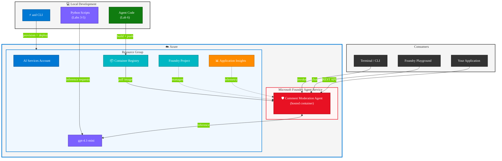

# Lab 7: Workshop Summary and Learning Outcomes

> **Duration:** ~10 minutes | **Phase:** Reflection and Review

## Objective

Review the complete journey from discovering a model in the Foundry catalog to deploying a production-ready hosted agent. This lab consolidates what you built, the skills you acquired, and where to go next.

---

## Total Workshop Duration

| Lab | Title | Duration |
|-----|-------|----------|
| 1 | Discover Models in Microsoft Foundry | ~10 min |
| 2 | Create and Configure a Foundry Project | ~15 min |
| 3 | Connect and Send Your First Inference | ~15 min |
| 4 | Build a Comment Moderation Application | ~20 min |
| 5 | Compare Model Outputs *(optional)* | ~15 min |
| 6 | Deploy a Hosted Agent | ~20 min |
| 7 | Workshop Summary and Learning Outcomes | ~10 min |
| | **Core labs (1-4, 6-7)** | **~90 min** |
| | **All labs including optional Lab 5** | **~105 min** |

---

## What You Built

Across six labs, you constructed a **comment moderation pipeline** end-to-end — from a blank terminal to a cloud-hosted agent accessible via REST API:

```mermaid
%%{init: {'theme': 'base', 'themeVariables': {'primaryColor': '#0078D4', 'primaryTextColor': '#FFFFFF', 'primaryBorderColor': '#005A9E', 'lineColor': '#333333', 'fontSize': '15px', 'fontFamily': 'Segoe UI, sans-serif'}}}%%
flowchart LR
    L1["Lab 1\nDiscover Models"]
    L2["Lab 2\nProject Setup"]
    L3["Lab 3\nFirst Inference"]
    L4["Lab 4\nModeration App"]
    L5["Lab 5\nModel Comparison"]
    L6["Lab 6\nHosted Agent"]

    L1 -->|"select model"| L2
    L2 -->|"provision infra"| L3
    L3 -->|"send requests"| L4
    L4 -->|"build pipeline"| L5
    L5 -->|"optimize"| L6

    style L1 fill:#0078D4,stroke:#005A9E,color:#FFFFFF,stroke-width:2px
    style L2 fill:#00B7C3,stroke:#008F98,color:#FFFFFF,stroke-width:2px
    style L3 fill:#7B61FF,stroke:#6248CC,color:#FFFFFF,stroke-width:2px
    style L4 fill:#E81123,stroke:#B80D1A,color:#FFFFFF,stroke-width:2px
    style L5 fill:#FF8C00,stroke:#CC7000,color:#FFFFFF,stroke-width:2px
    style L6 fill:#107C10,stroke:#0B5A0B,color:#FFFFFF,stroke-width:2px
```



---

## Lab-by-Lab Recap

### Lab 1: Discover Models in Microsoft Foundry

| | |
|---|---|
| **What you did** | Browsed the Foundry model catalog, evaluated model properties, tested prompts in the Playground |
| **Key skill** | Selecting the right model for a task based on capabilities, pricing, and quotas |
| **Outcome** | Chose `gpt-4.1-mini` as the model for the workshop |

**Core concept:** Not all models are equal — task type, latency, cost, and region availability all factor into model selection.

---

### Lab 2: Create and Configure a Foundry Project

| | |
|---|---|
| **What you did** | Provisioned a complete Azure environment with `azd` — AI Services account, Foundry project, model deployment, monitoring, and RBAC |
| **Key skill** | Infrastructure-as-Code with Bicep, environment configuration with `azd` |
| **Outcome** | A fully provisioned Foundry project with a deployed model and local `.env` configuration |

**Core concept:** `azd` manages the full lifecycle — from infrastructure provisioning to environment variables — so you never touch the portal for deployment.

---

### Lab 3: Connect and Send Your First Inference

| | |
|---|---|
| **What you did** | Wrote Python code to authenticate with `DefaultAzureCredential` and send a chat completion request |
| **Key skill** | Using the Azure AI Projects SDK for model inference, understanding message roles and token usage |
| **Outcome** | A working script (`src/01_first_inference.py`) that sends prompts and receives model responses |

**Core concept:** Chat completions use a message array with system/user roles. The system message shapes the model's behavior; the user message is the input.

---

### Lab 4: Build a Comment Moderation Application

| | |
|---|---|
| **What you did** | Designed a system prompt for structured JSON classification, built a business logic layer with confidence thresholds, processed batches of comments |
| **Key skill** | Prompt engineering for structured output, building decision logic around model responses |
| **Outcome** | A complete moderation app (`src/02_comment_moderation.py`) that classifies comments as SAFE, NEEDS_REVIEW, or UNSAFE |

**Core concept:** The real value is in the system prompt + business logic combination. The model provides classification; your code makes the decisions.

---

### Lab 5: Compare Model Outputs

| | |
|---|---|
| **What you did** | Ran the same moderation prompts through `gpt-4.1-mini` and `gpt-4.1`, compared quality, latency, and cost |
| **Key skill** | Multi-model evaluation, cost-performance trade-off analysis, hybrid escalation patterns |
| **Outcome** | A comparison script (`src/03_model_comparison.py`) with side-by-side results and an optional hybrid routing mode |

**Core concept:** Cheaper models often perform well enough for most inputs. Reserve expensive models for low-confidence cases — this reduces cost while maintaining quality.

---

### Lab 6: Deploy a Hosted Agent

| | |
|---|---|
| **What you did** | Packaged the moderation logic as a Docker container, deployed it to Foundry Agent Service with `azd up`, tested via CLI and the Foundry Playground |
| **Key skill** | Containerized agent deployment, the Agent Framework SDK, hosted agent lifecycle management |
| **Outcome** | A live, cloud-hosted moderation agent accessible via the OpenAI Responses API |

**Core concept:** A hosted agent turns local Python code into a managed, scalable service — no infrastructure management, just `azd up`.

---

## Skills Acquired

By completing this workshop, you gained hands-on experience with:

### Azure & Infrastructure
- Navigating the Microsoft Foundry portal and model catalog
- Provisioning infrastructure with Bicep and `azd`
- Managing Azure resources (AI Services, ACR, RBAC, monitoring)
- Understanding Foundry project architecture (accounts, projects, deployments, capability hosts)

### Python & AI Development
- Authenticating with `DefaultAzureCredential` (no hardcoded keys)
- Sending chat completion requests via the Azure AI Projects SDK
- Engineering system prompts for structured JSON output
- Building business logic around model responses
- Comparing multiple models on identical tasks

### Agent Development & Deployment
- Using the Microsoft Agent Framework (`Agent`, `AzureAIAgentClient`)
- Writing a `Dockerfile` and `agent.yaml` manifest
- Local testing before cloud deployment
- Deploying containerized agents to Foundry Agent Service
- Invoking and monitoring agents via `azd ai agent` CLI
- Testing agents in the Foundry Playground

---

## Architecture Overview

The final system you built spans local development and Azure cloud services:



---

## Key Files You Created or Modified

| File | Purpose | Lab |
|------|---------|-----|
| `src/01_first_inference.py` | First chat completion request | Lab 3 |
| `src/02_comment_moderation.py` | Full moderation pipeline with batch + interactive modes | Lab 4 |
| `src/03_model_comparison.py` | Side-by-side model evaluation | Lab 5 |
| `src/agent/app.py` | Hosted agent with Agent Framework SDK | Lab 6 |
| `src/agent/agent.yaml` | Agent manifest (protocols, env vars) | Lab 6 |
| `src/agent/Dockerfile` | Container definition for the agent | Lab 6 |
| `src/agent/requirements.txt` | Python dependencies for the agent | Lab 6 |
| `.env` | Local environment configuration | Lab 2 |
| `azure.yaml` | `azd` project configuration | Lab 2 |
| `infra/main.bicep` | Infrastructure orchestration | Lab 2 |
| `infra/modules/ai-services.bicep` | AI Services, project, model, ACR, capability host | Lab 2 |

---

## Key Patterns and Takeaways

### 1. Prompt Engineering Drives Behavior

The system prompt is the most important piece of your application. A well-structured prompt with clear output format instructions (`SAFE`/`NEEDS_REVIEW`/`UNSAFE` with JSON schema) turns a general-purpose model into a specialized classifier.

### 2. Business Logic Wraps Model Output

Models provide probabilistic output — your code makes deterministic decisions. The confidence threshold pattern (auto-approve above 0.85, auto-block below, flag for review in between) is reusable across many AI applications.

### 3. Start Cheap, Escalate Smart

The hybrid model pattern from Lab 5 applies broadly: use a fast, cheap model for the majority of requests and only route low-confidence cases to a more capable (and expensive) model. This can reduce costs by 60-80% with minimal quality impact.

### 4. Local First, Cloud Second

Always test locally before deploying. The `python app.py` → `curl localhost:8088` workflow catches issues that are much harder to debug in the cloud.

### 5. Infrastructure as Code, Always

Every Azure resource in this workshop is defined in Bicep and managed by `azd`. This means the entire environment is reproducible, version-controlled, and deletable with a single command (`azd down`).

---

## CLI Commands Used

A complete reference of every CLI command used across the workshop:

| Command | Lab | Purpose |
|---------|-----|---------|
| `azd init` | 2 | Initialize the azd project |
| `azd provision` | 2 | Provision Azure infrastructure |
| `azd env set` | 2 | Set environment variables |
| `azd env get-values` | 2 | View current environment config |
| `python src/01_first_inference.py` | 3 | Run first inference script |
| `python src/02_comment_moderation.py` | 4 | Run moderation pipeline |
| `python src/03_model_comparison.py` | 5 | Run model comparison |
| `python src/agent/app.py` | 6 | Run agent locally |
| `azd up` | 6 | Provision + build + deploy |
| `azd deploy` | 6 | Rebuild and redeploy |
| `azd ai agent show` | 6 | Check agent status |
| `azd ai agent invoke` | 6 | Send message to agent |
| `azd ai agent monitor` | 6 | Stream agent logs |
| `azd down` | Cleanup | Delete all resources |

---

## Next Steps

Now that you have a working hosted agent, here are ways to extend what you built:

### Add More Classification Categories

Expand the system prompt to handle additional categories like `SPAM`, `OFF_TOPIC`, or `SENSITIVE_PERSONAL_DATA`. Update the business logic layer to route each category differently.

### Add Tools to the Agent

Use the Agent Framework's tool support to give the agent capabilities beyond text classification — for example, looking up user history, checking a blocklist database, or sending notifications.

### Build a Multi-Agent Workflow

Create a second agent (e.g. a response-drafting agent) and chain it with the moderation agent. The moderation agent classifies; the response agent drafts an appropriate reply based on the classification.

### Connect to a Frontend

The hosted agent exposes an OpenAI-compatible REST API. Connect it to a web application, Slack bot, or any frontend that can make HTTP requests to `/responses`.

### Set Up CI/CD

Use GitHub Actions with `azd` to automate deployments on every push to `main`. Create `.github/workflows/deploy.yml`:

```yaml
name: Deploy Moderation Agent

on:
  push:
    branches: [main]
    paths: ["src/agent/**"]

permissions:
  id-token: write
  contents: read

jobs:
  deploy:
    runs-on: ubuntu-latest
    steps:
      - uses: actions/checkout@v4

      - name: Install azd
        uses: Azure/setup-azd@v2

      - name: Log in to Azure
        uses: azure/login@v2
        with:
          client-id: ${{ vars.AZURE_CLIENT_ID }}
          tenant-id: ${{ vars.AZURE_TENANT_ID }}
          subscription-id: ${{ vars.AZURE_SUBSCRIPTION_ID }}

      - name: Deploy agent
        run: azd deploy --no-prompt
        env:
          AZURE_ENV_NAME: ${{ vars.AZURE_ENV_NAME }}
```

This workflow triggers only when agent code changes, uses workload identity federation (no stored secrets), and redeploys via `azd deploy`.

### Monitor in Production

Use Application Insights (already provisioned) to track agent performance. Open the Azure portal → your Application Insights resource → **Logs**, and run this KQL query:

```kql
requests
| where timestamp > ago(1h)
| summarize
    RequestCount = count(),
    AvgDuration = avg(duration),
    FailureRate = countif(success == false) * 100.0 / count()
  by bin(timestamp, 5m)
| order by timestamp desc
```

This shows request volume, average response time, and failure rate in 5-minute buckets — the three metrics you need to know your agent is healthy.

---

## Try It Yourself: Final Challenge

Put everything together by building a **new classifier** from scratch. Pick one of these (or invent your own):

| Challenge | System Prompt Idea | Test Data |
|-----------|-------------------|------------|
| **Sentiment analyzer** | Classify as `POSITIVE`, `NEGATIVE`, or `NEUTRAL` with a confidence score | Product reviews |
| **Support ticket router** | Classify as `BILLING`, `TECHNICAL`, `FEATURE_REQUEST`, or `OTHER` | Sample support emails |
| **Language detector** | Return the language name and ISO code for any input text | Sentences in different languages |

**Steps:**
1. Copy `src/02_comment_moderation.py` to a new file (e.g., `src/04_my_classifier.py`)
2. Rewrite the system prompt for your chosen task
3. Create a `sample_data.json` with 5-10 test inputs
4. Run it and verify the JSON output parses correctly
5. *(Bonus)* Wrap it as a hosted agent using the same pattern from Lab 6

This exercise proves you can apply the inference → structured output → business logic pattern to **any** classification problem, not just content moderation.

---

## Clean Up

If you haven't already, remove all Azure resources to avoid ongoing charges:

```bash
azd down --force --purge
```

This deletes the resource group, all resources within it, and purges any soft-deleted AI Services accounts. See [Cleanup Guide](../cleanup/CLEANUP.md) for more options.

---

## Thank You

You started with a model in a catalog and finished with a production-ready hosted agent on Microsoft Foundry. The patterns you learned — prompt engineering, structured output, confidence-based routing, containerized deployment — apply to any AI application, not just content moderation.

**Happy building!**
