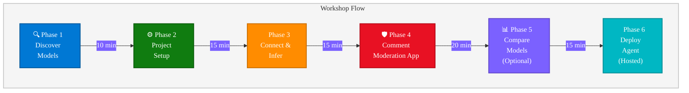

# Get Started with Models in Microsoft Foundry: From First Inference to Deployed Agent

> **Duration:** 90-105 minutes | **Level:** Intermediate | **Format:** Code-first, hands-on lab

## Abstract

In this hands-on lab, you will go from zero to a production-ready application using Microsoft Foundry, with no fine-tuning or deep ML expertise required. Starting with the Foundry model catalog, you will provision a project, connect to a hosted model via the OpenAI SDK (through the Azure AI Projects client), and build a complete comment moderation pipeline that classifies user-generated content as safe, needs review, or unsafe. You will compare outputs across models to make informed deployment decisions, then package your moderation logic into a hosted agent running on Foundry's managed infrastructure. By the end of the session, you will have working Python code, a deployed agent accessible via the OpenAI Responses API, and the confidence to integrate production-ready models into your own applications.

---

## Workshop Overview

Go from zero to a working application by integrating a production-ready model into a real-world **comment moderation** use case using **Microsoft Foundry**, with no fine-tuning or deep ML expertise required.

This is a **code-first lab** where programming experience is key. You will work primarily in the terminal and editor, using SDKs and Foundry APIs to build a functional inference pipeline.

> **Lab Platform:** This lab base has been successfully used with Skillable for Microsoft Build & Microsoft Ignite labs.

---

## Learning Objectives

By the end of this workshop, you will be able to:

| # | Objective |
|---|-----------|
| 1 | Discover available hosted models using Microsoft Foundry |
| 2 | Create and configure a Foundry project |
| 3 | Connect application code to a model inference endpoint |
| 4 | Send structured user input to a model |
| 5 | Process model responses programmatically |
| 6 | Apply moderation and classification logic to real content |
| 7 | Compare outputs across models *(optional extension)* |
| 8 | Package a moderation agent and deploy to hosted compute |
| 9 | Validate inference locally in real time |

---

## Prerequisites

- Azure account with an active subscription ([free account](https://azure.microsoft.com/free/))
- Role allowing creation of Foundry resources (Azure AI Owner or Contributor)
- Quota for at least one hosted model (e.g., `gpt-5.4-mini`)
- Python 3.10+ installed
- Azure CLI installed ([install guide](https://aka.ms/installazurecli))
- Azure Developer CLI installed ([install guide](https://aka.ms/azure-dev/install))
- Code editor (Visual Studio Code recommended with [Foundry Toolkit Extension](https://marketplace.visualstudio.com/items?itemName=ms-windows-ai-studio.windows-ai-studio))

---

## Lab Architecture



---

## Lab Modules

| Phase | Module | Duration | Description |
|-------|--------|----------|-------------|
| 0 | [Setup](setup/SETUP.md) | 10 min | Environment setup + authentication |
| 1 | [Discover Models](labs/lab1-discover-models.md) | 10 min | Navigate Foundry portal, explore model catalog |
| 2 | [Project Setup](labs/lab2-project-setup.md) | 15 min | Create Foundry project, configure resources |
| 3 | [Connect & Infer](labs/lab3-connect-and-infer.md) | 15 min | SDK setup, authenticate, send first inference |
| 4 | [Comment Moderation App](labs/lab4-comment-moderation.md) | 20 min | Build a working moderation pipeline |
| 5 | [Model Comparison](labs/lab5-model-comparison.md) | 15 min | *(Optional)* Compare outputs across models |
| 6 | [Deploy Agent](labs/lab6-deploy-agent.md) | 20 min | Package moderation as a hosted agent |
| 7 | [Summary](labs/lab7-summary.md) | 10 min | Workshop summary and learning outcomes |
| - | [Cleanup](cleanup/CLEANUP.md) | 5 min | Remove Azure resources |

---

## Project Structure

```
Get_Started_with_Models_Microsoft_Foundry/
├── README.md                          # This file
├── azure.yaml                         # azd project manifest
├── requirements.txt                   # Python dependencies
├── .env.sample                        # Environment variable template
├── infra/
│   ├── main.bicep                     # Main Bicep orchestration
│   ├── main.parameters.json           # Deployment parameters
│   ├── abbreviations.json             # Resource name prefixes
│   └── modules/
│       ├── ai-services.bicep          # Foundry account + project + models
│       ├── monitoring.bicep           # Log Analytics + App Insights
│       └── role-assignments.bicep     # RBAC for signed-in user
├── scripts/
│   ├── setup.ps1                      # One-command setup (Windows)
│   ├── setup.sh                       # One-command setup (Linux/macOS)
│   ├── postprovision.ps1              # azd post-provision hook (Windows)
│   └── postprovision.sh               # azd post-provision hook (Linux/macOS)
├── setup/
│   └── SETUP.md                       # Environment setup guide
├── labs/
│   ├── lab1-discover-models.md        # Phase 1: Model discovery
│   ├── lab2-project-setup.md          # Phase 2: Project setup
│   ├── lab3-connect-and-infer.md      # Phase 3: First inference
│   ├── lab4-comment-moderation.md     # Phase 4: Moderation app
│   ├── lab5-model-comparison.md       # Phase 5: Model comparison
│   ├── lab6-deploy-agent.md           # Phase 6: Deploy hosted agent
│   └── lab7-summary.md               # Phase 7: Summary and outcomes
├── src/
│   ├── 01_first_inference.py          # Phase 3: Basic inference
│   ├── 02_comment_moderation.py       # Phase 4: Full moderation app
│   ├── 03_model_comparison.py         # Phase 5: Multi-model comparison
│   ├── sample_comments.json           # Test data for moderation
│   └── agent/
│       ├── app.py                     # Agent entry point (hosting adapter)
│       ├── agent.yaml                 # Agent metadata and manifest
│       ├── Dockerfile                 # Container image definition
│       └── requirements.txt           # Agent-specific dependencies
├── tests/
│   ├── TESTING.md                     # Testing instructions
│   └── validate_lab.py                # Automated validation (100 checks)
└── cleanup/
    └── CLEANUP.md                     # Resource cleanup guide
```

---

## Quick Start

### Option A: One-command setup (provisions Azure resources + configures everything)

```powershell
# Windows (PowerShell)
.\scripts\setup.ps1

# Linux / macOS
./scripts/setup.sh
```

### Option B: Manual azd provisioning

```bash
azd init --no-prompt -e foundry-lab
azd provision --no-prompt
pip install -r requirements.txt
python src/01_first_inference.py
```

### Option C: Already have a Foundry project

```bash
pip install -r requirements.txt
cp .env.sample .env
# Edit .env with your project endpoint and model deployment name
python src/01_first_inference.py
```

---

## Technical Constraints

| Constraint | Detail |
|-----------|--------|
| No fine-tuning | Uses hosted production-ready models only |
| Model-agnostic | Code works with any chat completion model |
| Minimal ML expertise | Focus on integration, not model internals |
| Working artifact | Participants leave with a functional application |

---

## Expected Outputs

After completing this workshop, you will have:

- ✅ A configured Foundry project
- ✅ A working model-connected application
- ✅ Code capable of sending inference requests
- ✅ Logic for comment moderation and classification
- ✅ A deployed hosted agent running your moderation logic in Microsoft Foundry
- ✅ An extendable foundation for agents, automation workflows, and production services

---

## Success Criteria

The workshop is considered successful when participants can:

1. Access models through Microsoft Foundry
2. Integrate inference into application logic
3. Use prompt-based approaches for production tasks
4. Build confidence working with models without fine-tuning
5. Produce working code extendable into agent workflows

---

## Resources

- [Microsoft Foundry Documentation](https://learn.microsoft.com/azure/ai-foundry/)
- [Create a Foundry Project](https://learn.microsoft.com/azure/ai-foundry/how-to/create-projects)
- [OpenAI SDK migration guide](https://learn.microsoft.com/azure/foundry/how-to/model-inference-to-openai-migration)
- [Foundry Samples on GitHub](https://github.com/azure-ai-foundry/foundry-samples)

---

*This lab is designed for Microsoft Build / Ignite style hands-on workshops and is compatible with Skillable lab environments.*
